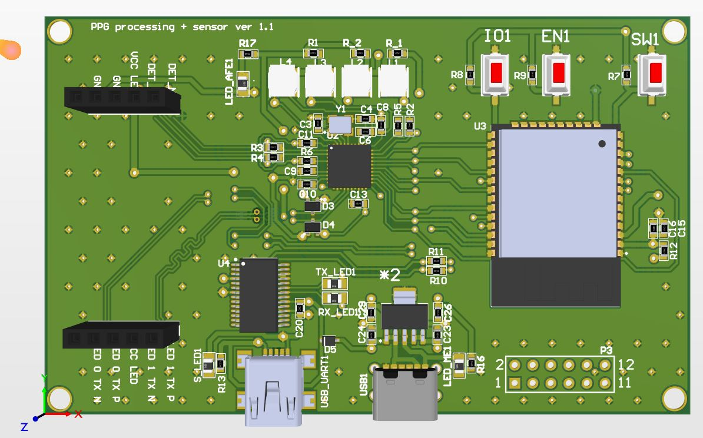
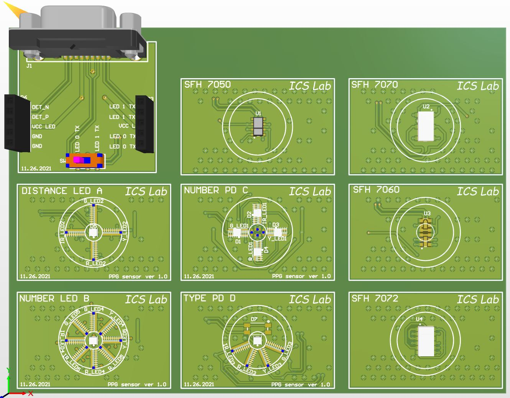
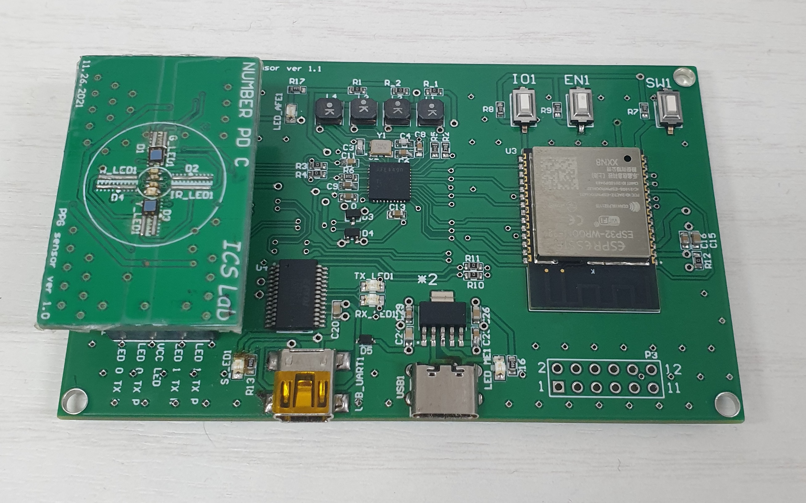

# PPG Sensor & Processing Device (Hardware Design)

This repository contains the hardware design files (Altium Designer) for a Photoplethysmography (PPG) sensor hand-held device. This project was developed as part of a research initiative aimed at improving signal quality from PPG sensor for wearable health monitoring.

## Project Structure

The hardware design is divided into two primary modules:

### 1. Processing Board (`PPG_processing/`)
The main logic and power management board.
- **Microcontroller**: ESP32 (Wi-Fi/Bluetooth enabled MCU)
- **Key Schematics**: 
  - `ESP32.SchDoc`: Microcontroller and IO setup.
  - `DRIVER_LED&AFE.SchDoc`: AFE4490 and LED current control.
  - `POWER_SUPPLY.SchDoc`: Voltage regulation.
- **PCB Layout**: `PPG_board.PcbDoc`
- **Project File**: `PPG_process_v2.PrjPcb`

### 2. PPG Sensor Board (`PPG_sensor/`)
The optical interface module.
- **Key Files**: `PPG_sensor.SchDoc`, `PPG_sensor.PcbDoc`
- **Project File**: `PPG_sensor.PrjPcb`

## Tools Used
- **EDA Tool**: Altium Designer

## Visuals

### 3D View of Processing Board

### Key Schematics (Processing Board)
#### ESP32 Microcontroller

#### Analog Front End (AFE4490)

#### Power Management

## How to Use
1. Clone the repository.
2. Open the project file:
   - `PPG_processing/PPG_process_v2.PrjPcb` for the main board.
   - `PPG_sensor/PPG_sensor.PrjPcb` for the sensor board.
3. Use Altium Designer to view/edit.

## License
This project is licensed under the **MIT License** - see the [LICENSE](LICENSE) file for details.
